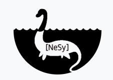

# The 2nd International Joint Conference on Learning & Reasoning (IJCLR 2022)
## [Cumberland Lodge](https://www.cumberlandlodge.ac.uk/), Windsor Great Park, UK, and online from 28-30 September 2022

The 1st International Joint Conference on Learning & Reasoning ([IJCLR 2021](http://lr2020.iit.demokritos.gr)) took place from 25-27 October 2021 (virtual). [[Video recordings]](https://www.youtube.com/playlist?list=PL18_rB75vx1PkjXnkX1jiqNeNnVCbNGIh). 

The rapid progress in machine learning has been the primary reason for a fresh look in the transormative potential of AI during the past decade. A crucial milestone for taking full advantage of this potential is the endowment of algorithms that learn from experience with the ability to consult existing knowledge and reason about what has been learned. Integrating learning and reasoning constitutes one of the key open questions in AI and holds the potential of addressing many of the shortcomings of contemporary AI approaches, including the black-box nature and brittleness of deep learning but also the difficulty to adapt knowledge representation models in the light of new data. Integrating learning and reasoning calls for approaches that combine knowledge representation and reasoning with learning algorithms from the fields of neural, statistical and relational learning.

Four international conferences and workshops addressing research on learning and reasoning will join forces in the 2nd International Conference on Learning & Reasoning (IJCLR 2022):

- The [31st International Conference on Inductive Logic Programming (ILP)](https://ijclr22.doc.ic.ac.uk/ilp2022.html) The ILP conference series has been the premier forum for work on logic-based approaches to learning for three decades. Originally focusing on the induction of logic programs, over the years it has expanded its research horizon to other forms of relational learning and to probabilistic approaches.
- The [16th International Workshop on Neural-Symbolic Learning & Reasoning (NeSy)](https://sites.google.com/view/nesy-2022/) The NeSy workshop series is the longest standing gathering for the presentation and discussion of cutting edge research in [neurosymbolic AI](http://www.neural-symbolic.org/). NeSy is the yearly meeting of the [Neural-Symbolic Learning and Reasoning Association](https://www.city-data-science-institute.com/nesy).
- The 11th International Workshop on Approaches and Applications of Inductive Programming (AAIP) The AAIP workshop series focuses on learning executable programs in arbitrary programming languages, from incomplete specifications. e.g. from examples of their input/output behaviour.
- The 3rd International Workshop on Human-Like Computing (HLC) HLC research aims to endow machines with human-like perceptual, reasoning and learning abilities which support collaboration and communication with human beings. The workshop aim is to bring together leading experts in AI and Cognitive Science to investigate areas of fruitful interaction in which human co-operative and communicative skills can be studied and modelled computationally.

## IJCLR Steering Committee

Luc De Raedt, KU Leuven, Belgium  
Stephen Muggleton, Imperial College London, UK  
Artur d’Avila Garcez, City University of London, UK  
Ute Schmid, University of Bamberg, Germany  
Nikos Katzouris, NCSR "Demokritos", Greece  
Sebastijan Dumančić, KU Leuven, Belgium  

## IJCLR 2022 Organizing Committee

Stephen Muggleton, Imperial College London, UK (General Chair)  
Alireza Tamaddoni-Nezhad, University of Surrey, UK  
Artur d’Avila Garcez, City University of London, UK  
Ernesto Jiménez-Ruiz, City University of London, UK  
Ute Schmid, University of Bamberg, Germany  
Cèsar Ferri, Universitat Politènica de València, Spain  
Alan Bundy, University of Edinburgh, Scotland  
Denis Mareschal, Birkbeck, University of London, UK  

## Enquiries:

Please contact Bridget Gundry at bridget.gundry@imperial.ac.uk

